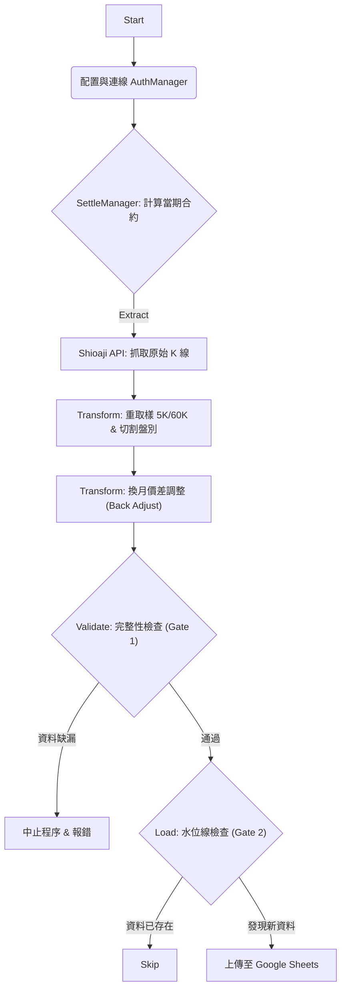
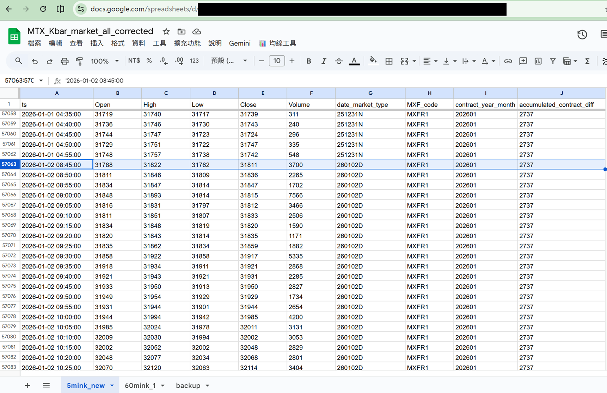

# TXF Continuous Data Pipeline (台指期連續月資料自動化 ETL)

   

---

## 📖 專案背景 (Motivation)

在建立個人化交易回測系統 (Backtesting System) 時，高品質的歷史資料是不可或缺的基石。然而，坊間免費的資料源常面臨以下痛點：
1.  **換月斷層 (Rollover Gap)**：期貨合約每月結算，直接串接會導致價格跳空，嚴重影響技術指標計算。
2.  **資料完整性不足**：常有漏抓 K 棒或資料錯誤的情況。
3.  **成本高昂**：高品質的連續月資料通常需要付費訂閱。

本專案旨在解決上述問題，利用 **永豐金 Shioaji API** 作為可靠資料源，構建一個自動化 ETL 流程，產出**經過去除斷層 (Back-adjusted)** 的連續月 K 線資料，並儲存於 **Google Sheets**。這不僅成本低廉，且能無縫整合 Google Apps Script (GAS) 與 GCP，為後續的雲端回測系統鋪路。

---

## 🚀 核心功能 (Key Features)

* **自動化換月價差調整 (Auto Back-Adjustment)**：
    * 依據歷史結算價差，自動修正舊合約價格，產生適合回測的連續月資料。
    * 自動預測下一次結算日與合約代碼。
* **嚴格的資料品質檢核 (Data Quality Gate)**：
    * 實作 **Gate 1** 機制：針對日盤 (60筆/5分K) 與夜盤 (168筆/5分K) 進行完整性檢查。
    * 若 API 資料缺漏，系統會自動阻斷上傳，防止污染資料庫。
* **冪等性設計 (Idempotency)**：
    * 實作 **Gate 2** 機制：透過水位線 (Watermark) 比對，確保重複執行也不會產生重複資料。
* **穩健的錯誤處理 (Robust Error Handling)**：
    * API 連線採用 **指數退避 (Exponential Backoff)** 重試機制。
    * 模組化設計 (OOP)，易於維護與擴充。

---

## 🛠️ 系統架構 (ETL Architecture)

本系統採用標準的 ETL 流程設計：



1. **Extract**: 從 Shioaji API 獲取指定日期的 1 分鐘 K 線。
2. **Transform**:
* Resample 為 5 分鐘與 60 分鐘 K 線。
* 分割日盤 (08:45-13:45) 與夜盤 (15:00-05:00)。
* **關鍵邏輯**：依照結算表進行價格平移，消除換月缺口。


3. **Load**: 透過 `gspread` 批次寫入 Google Sheets。

---

## 📊 資料庫結構 (Data Schema)

本系統依賴 Google Sheets 中的 `TXF_settle_date_price` 表單來進行結算邏輯判斷。請確保你的試算表包含以下欄位：

| 欄位名稱 | 說明 | 範例 |
| :--- | :--- | :--- |
| `contract_year_month` | 合約月份 | 202511 |
| `next_contract_diff` | 與次月合約價差 | -49 |
| `accumulated_contract_diff` | 累積調整點數 | 2955 |
| `start_k` | 該合約開始時間 | 2025-10-15 13:30:00 |
| `settle_k` | 該合約結算時間 | 2025-11-19 13:25:00 |

*(詳細格式可參考專案中的 `settle_config_template.csv`)*

> **⚠️ 重要說明：時間標記慣例 (Timestamp Protocol)**
>
> 本系統產出的 `ts` 欄位採用 **「開盤時間 (Open Time)」** 作為標記，此邏輯與 **XQ 全球贏家** 及 **Shioaji API** 原生定義一致。
>
> * **定義範例**：標記為 `09:00:00` 的 5 分 K 線，代表 `09:00:00` (Open) 至 `09:05:00` (Close) 這段區間的行情。
> * **相容性提醒**：若您使用的其他資料源（如 **三竹系統 / Mitake**）習慣採用「收盤時間」標記（即同一根 K 棒標記為 `09:05:00`），在進行策略回測或資料對齊時請務必進行時間平移，以避免產生錯誤。


---

## ⚙️ 技術堆疊 (Tech Stack)

* **語言**: Python
* **資料源**: Shioaji API (Sinopac)
* **資料處理**: Pandas (Time-series resampling, DataFrame manipulation)
* **資料儲存**: Google Sheets API (via `gspread`)
* **環境**: Google Colab / Local Python Environment

---

## 🔧 設定與執行 (Configuration & Usage)

本專案採用通用環境變數設計，支援 **Local (本機/VPS)** 與 **Google Colab** 兩種執行環境。請依據您的需求擇一設定。

### 方式 A：Local / Docker / VPS 環境 (推薦)

適合長期自動化排程 (Cron Job)。

1.  **安裝套件**
    ```bash
    pip install -r requirements.txt
    ```

2.  **設定環境變數 (.env)**
    在專案根目錄建立一個名為 `.env` 的檔案，並填入以下內容：
    *(注意：請勿將此檔案上傳至 GitHub)*
    ```ini
    SHIOAJI_API_KEY=你的永豐API_Key
    SHIOAJI_SECRET_KEY=你的永豐Secret_Key
    GSHEET_CREDENTIALS={"type": "service_account", ...}  <-- JSON 字串需壓縮成一行
    GSHEET_ID_DATA=你的K棒資料表ID
    GSHEET_ID_SETTLE=你的結算設定表ID
    ```

3.  **執行程式**
    ```bash
    python main.py
    ```

### 方式 B：Google Colab 環境

適合快速測試或無伺服器執行。

1.  **上傳檔案**
    將 `main.py`, `requirements.txt`, `settle_config_template.csv` 上傳至 Colab 檔案區。

2.  **設定 Secrets (密鑰)**
    * 點選 Colab 左側側邊欄的 **🔑 (Secrets/密鑰)** 圖示。
    * 依序新增以下變數名稱與對應的值：
        * `SHIOAJI_API_KEY`
        * `SHIOAJI_SECRET_KEY`
        * `GSHEET_CREDENTIALS`
        * `GSHEET_ID_DATA`
        * `GSHEET_ID_SETTLE`
    * 開啟每個變數旁邊的 **Notebook access** 開關。

3.  **執行**
    在 Notebook 單元格中執行：
    ```python
    !pip install -r requirements.txt
    !python main.py
    ```

---

## 📈 成果展示 (Demo)

下圖為自動化 ETL 流程執行後的實際產出結果。系統成功將 Shioaji API 抓取的原始資料，經過清洗、重取樣 (Resample) 與價差調整後，寫入 Google Sheet 資料庫。



### 🧐 看圖重點 (Technical Highlights)
1.  **跨盤別自動銜接**：
    請觀察 `date_market_type` 欄位，資料從 `251231N` (跨年夜盤) 完美銜接到 `260102D` (元旦後首個日盤)，證明系統的時間切割邏輯正確處理了跨日與跨年情境。
2.  **換月價差修正**：
    `accumulated_contract_diff` 欄位顯示了數值 (如範例中的 `2737`)，代表系統已自動將歷史換月缺口補齊，這是進行精確回測的關鍵。
3.  **資料完整性**：
    包含自動生成的 `MXF_code` (合約代碼) 與 `contract_year_month`，讓每一筆 K 棒都能追溯其原始合約。
---

## 📝 後續可能規劃 (Roadmap)

* 整合 **Line Notify** 進行執行結果推播。
* 遷移至 **Docker** 並部署於 VPS (如 GCP e2-micro)。
* 串接 **Google Apps Script** 觸發回測策略信號。


---

## 👨‍💻 作者

**Eason**
一位喜歡用自動化工具解決生活瑣事的資深工程師。

---

## 📜 License

[MIT](LICENSE)

